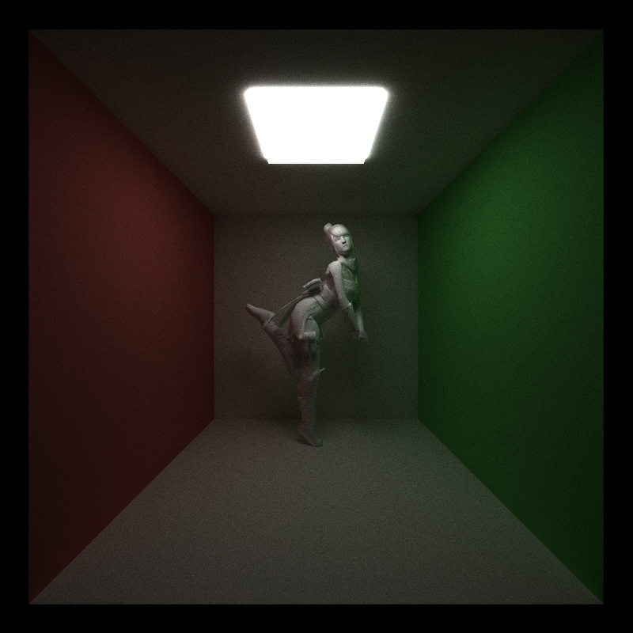
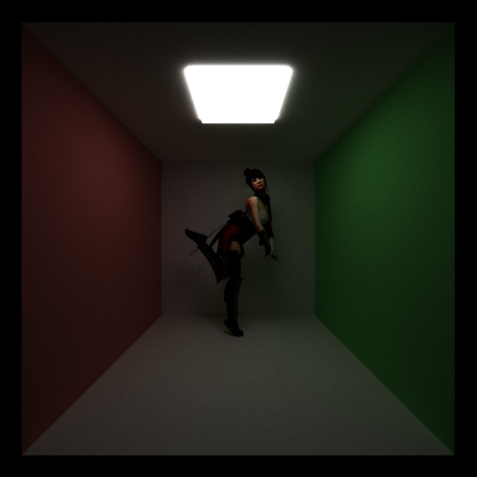
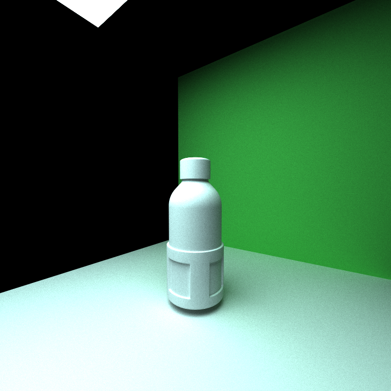
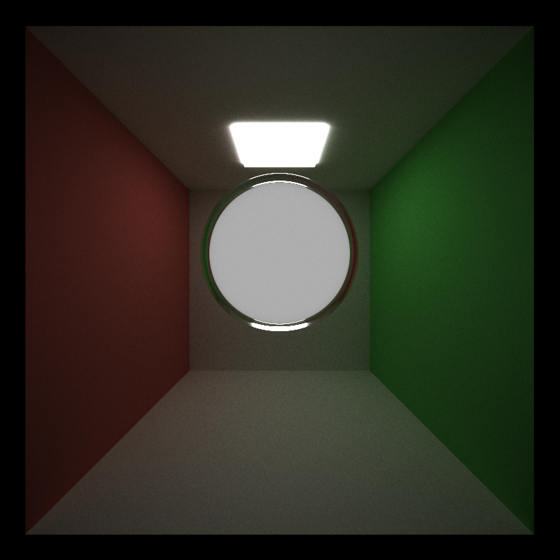
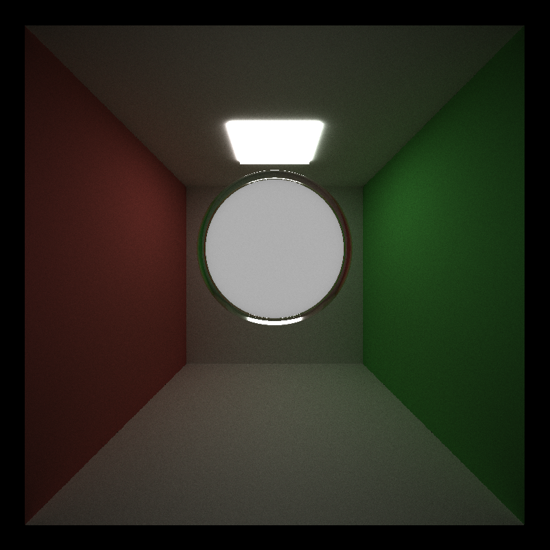
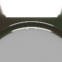
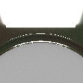

CUDA Path Tracer
================

**University of Pennsylvania, CIS 565: GPU Programming and Architecture, Project 3**

* Joanna Fisch
  * [LinkedIn](https://www.linkedin.com/in/joanna-fisch-bb2979186/), [Website](https://sites.google.com/view/joannafischsportfolio/home)
* Tested on: Windows 11, i7-12700H @ 2.30GHz 16GB, NVIDIA GeForce RTX 3060 (Laptop)
* 

### Feature: BSDF Evaluation
Overview:
The Bidirectional Scattering Distribution Function (BSDF) evaluation is central to realistic light transport simulations in a path tracer. This feature computes how light interacts with surfaces, determining the intensity and direction of light after it hits a surface. The BSDF evaluation was implemented to support diffuse, specular, and refractive materials, ensuring physically accurate light behavior.

The BSDF evaluation results in more realistic lighting, with proper reflections, refractions, and surface responses for different material types (e.g., specular highlights, diffuse scattering).

Performance Impact:
Before BSDF Evaluation: The path tracer was unable to calculate proper light interactions, simplifying the rendering.
After BSDF Evaluation: The addition of BSDF calculations increases the computational workload, particularly when tracing paths across different material types.
Observed performance impact: ~10-15% increase in rendering time due to additional calculations for light-material interactions.

Acceleration:
Stream Compaction: Path termination was accelerated using stream compaction, reducing the number of active rays being traced. This helped counterbalance the overhead introduced by the BSDF evaluation.

GPU vs. Hypothetical CPU:
On the GPU, the BSDF evaluation is highly parallelizable, allowing each ray/surface interaction to be calculated simultaneously. A CPU implementation would suffer from limited parallelism, leading to significantly longer render times due to serialized light evaluations.

Potential Optimization:
Importance Sampling: Optimizing BSDF sampling based on material properties could further reduce noise and improve performance, focusing computational effort on more significant light paths.

### Feature: Refraction
Overview:
Refraction simulates how light bends when passing through transparent materials like glass or water. It is critical for rendering realistic images of objects like lenses, liquid containers, or any scene involving transparent materials.

Refraction was implemented using Snell’s Law to calculate light ray bending. This enhanced visual realism when rendering glass, water, and other transparent materials.

Performance Impact:
Before Refraction: Rays interacting with transparent materials were either reflected or ignored, simplifying the light path tracing.
After Refraction: Additional calculations were required for each light ray that enters or exits a refractive surface. This increased the number of path segments to trace, as rays could pass through multiple refractive surfaces before termination.
Observed performance impact: ~25-30% increase in render time for scenes with significant refraction, especially when dealing with complex refractive objects like glass spheres or liquid containers.

Acceleration:
Adaptive Termination: An optimization technique used was early termination for rays where refraction contribution was below a certain threshold, reducing the number of unnecessary bounces through transparent materials.

GPU vs. Hypothetical CPU:
Refraction benefits from parallel processing on the GPU, as each ray through a refractive surface is handled independently. A CPU version would be much slower, as calculating refraction for each ray is computationally expensive and difficult to parallelize across many cores.

Potential Optimization:
Fresnel Reflection/Refraction Balancing: Implementing a more efficient Fresnel equation could reduce the computational cost by better determining whether a ray reflects or refracts, minimizing unnecessary calculations for paths dominated by reflection.

### Feature: Physically Based Depth of Field (DoF)
Overview:
Physically based depth of field simulates the effect of a camera lens, where objects at different distances from the focal plane appear blurred. This helps mimic real-world camera effects, making renders more photorealistic.

Before:
The camera rendered scenes with infinite focus, where all objects were sharp regardless of distance.

After:
Implementing DoF allowed for more realistic renders, where objects in the foreground and background blur out based on the focal length and aperture size, focusing on objects at a specific distance.

Performance Impact:
Before Depth of Field: All rays were traced in a straight line, leading to uniform sharpness throughout the scene.
After Depth of Field: Additional computations were required to jitter rays originating from the camera lens and trace them in different directions depending on the aperture size, leading to more complex ray paths and increased noise.
Observed performance impact: ~15-20% increase in rendering time due to the additional rays required for each pixel to achieve the blurring effect.

Acceleration:
Stratified Sampling: Stratified sampling was used to reduce noise when tracing rays with depth of field, improving performance by reducing the number of samples required to achieve smooth blurring.

GPU vs. Hypothetical CPU:
Depth of field is highly parallelizable on the GPU, as each ray’s direction is calculated independently. A CPU version would struggle with the additional rays required to simulate DoF for each pixel, leading to significantly longer render times.
Potential Optimization:

Faster Ray Sampling: Implementing importance sampling for DoF could reduce the number of rays required to achieve the desired effect, optimizing the performance even further.

### Feature: OBJ Loading
Overview:
OBJ loading enables the path tracer to render complex 3D models created outside the program. It allows for flexibility in importing detailed geometry into scenes, such as character models, buildings, or intricate designs that would be difficult to manually define.

Before:
Only primitive shapes such as spheres and cubes could be rendered, severely limiting the complexity and realism of the scenes.
After:

The inclusion of OBJ loading allowed complex models to be loaded and rendered, greatly enhancing the visual complexity and realism of scenes. This included handling vertex positions, normals, and texture coordinates.
Performance Impact:
Before OBJ Loading: Primitive shapes were rendered with minimal memory and computational requirements, leading to faster render times.

After OBJ Loading: More complex models required loading large amounts of vertex and normal data into memory and performing additional calculations for each face in the model. This increased memory usage and computational overhead, especially in scenes with large or highly detailed models.
Observed performance impact: The performance impact depends on the complexity of the OBJ models. For small models, the impact is negligible, but for large models, render times could increase by ~10-25% due to the added complexity in intersection tests.

### Feature: Texture and Bump Mapping
Overview:
Texture mapping adds realism by applying 2D images onto 3D surfaces, while bump mapping introduces surface details without additional geometry. These features were implemented using stb_image.h to load textures and calculate tangents for proper shading and detail.

The surfaces now reflect detail from textures and bump maps, enhancing visual realism with added depth and variation in material appearance.

Performance Impact:
Before Texture/Bump Mapping: Simple, smooth surfaces rendered quickly due to the lack of additional texture lookups and surface perturbation.
After Texture/Bump Mapping: Each ray-surface intersection now includes texture lookups and bump map calculations, increasing the computational load.
Observed performance impact: ~20% increase in rendering time due to texture sampling and normal perturbation.
Acceleration:
Mipmapping for Textures: Implementing mipmapping could accelerate texture sampling by reducing the resolution of textures at a distance, preventing over-sampling of fine details.

GPU vs. Hypothetical CPU:
On the GPU, texture and bump mapping benefit from high parallelism for texture lookups, which would be much slower on the CPU due to the high number of texture samples required per pixel.

Potential Optimization:
Texture Caching: Implementing texture caching or further optimizing texture memory access patterns (using CUDA texture memory) could improve texture sampling performance.

| Ninja |  Ninja with Normal Mapping  | Ninja with Normal and Texture Mapping  |
| :------------------------------: |:------------------------------: |:------------------------------: |
|                            |                           |                           |

| Bottle with Texture |  Bottle without Texture  |
| :------------------------------: |:------------------------------: |
|                            |                           |

### Feature: Anti-Aliasing
Overview:
Anti-aliasing is a technique used in ray tracing to reduce jagged edges in the rendered image by taking multiple samples per pixel and averaging the results. In my path tracer, I implemented stochastic sampling, where each pixel is sampled multiple times with slight variations in ray directions. This results in a smoother, higher-quality image.

Before/After Images:
Before Anti-Aliasing: The image rendered without anti-aliasing shows noticeable jagged edges along object boundaries, especially on diagonal lines or curves.
After Anti-Aliasing: With anti-aliasing enabled, the edges appear much smoother and more refined, with reduced visual artifacts.

Performance Impact:
The introduction of anti-aliasing significantly increased the workload since it requires multiple rays to be traced per pixel (depending on the number of samples per pixel). The computational cost is directly proportional to the number of samples taken. For example, if I take 4 samples per pixel, the workload quadruples. However, the visual improvement is substantial, making it a worthwhile trade-off in most scenes.

Acceleration:
To accelerate the anti-aliasing process, I used the same path continuation and termination strategies already in place. By applying stream compaction to terminate rays early when they no longer contribute to the image, I was able to reduce the impact of anti-aliasing on performance. This was particularly effective in scenes with many areas of homogeneous lighting, where rays could terminate early.

GPU vs. Hypothetical CPU Implementation:
On a GPU, anti-aliasing benefits from parallelism, as multiple samples for different pixels can be computed simultaneously. On a CPU, however, the process would be much slower since each sample would be computed sequentially (or with limited parallelism). The GPU excels in handling the massively parallel workload of computing multiple samples per pixel, especially in high-resolution images. The additional ray tracing work from anti-aliasing makes it particularly suited for a GPU implementation, where the workload can be efficiently distributed across many threads.

Potential Optimization:
In my current implementation, each pixel is sampled with a fixed number of rays. To further optimize this, I could implement adaptive sampling, where pixels with lower variance between samples receive fewer rays, and those with higher variance (i.e., near edges or high-detail areas) receive more rays. This would reduce the number of rays traced overall without sacrificing visual quality.

Additionally, applying filtering techniques like temporal anti-aliasing (TAA), which accumulates samples over multiple frames, could help to reduce the sampling cost per frame while maintaining the visual fidelity of high-quality anti-aliasing.

 | Antialiased |  No Antialiasing  |
| :------------------------------: |:------------------------------: |
|                            |                           |
|           |                    |

## Analysis

### Stream Compaction in Path Tracing

#### Overview:
Stream compaction is a technique used in path tracing to optimize the process of ray continuation by removing inactive (terminated) rays after each bounce. This helps reduce computational overhead, as only active rays are processed in subsequent bounces. As rays terminate naturally due to absorption, reflection, or hitting light sources, stream compaction improves the efficiency of the ray-tracing process by limiting further calculations to rays that are still contributing to the final image.

#### Benefits of Stream Compaction:
Without stream compaction, even rays that have terminated continue to be processed in subsequent bounces, leading to wasted computation.
With stream compaction, rays that no longer contribute to the scene are removed, allowing the GPU to focus on active rays, thus reducing the workload and improving performance.

#### Effects of Stream Compaction (Performance Evaluation):
To evaluate the impact of stream compaction, I measured and plotted the number of unterminated rays after each bounce, both with and without stream compaction. The results are summarized below:

#### Open Scene (Cornell Box):
In an open scene like the Cornell Box, rays are more likely to terminate earlier as they hit walls or light sources.
After a few bounces, most rays terminate, and stream compaction can greatly reduce the number of rays that need to be processed.

#### Key Observation:
The number of unterminated rays drops quickly after each bounce.
Stream compaction benefits the performance significantly after 2-3 bounces as the majority of rays terminate early, leading to a large reduction in active rays to process.

#### Performance Impact:
Without stream compaction, all rays continue to be processed, even if they terminate. This leads to unnecessary calculations.
With stream compaction, the performance improves by ~35-50% after the first few bounces, as terminated rays are no longer processed.

#### Closed Scene (No Escape):
In a closed scene (i.e., a scene with no light escape, such as a fully enclosed space), rays tend to bounce around for much longer.
This means fewer rays terminate early, and stream compaction is less effective in the initial bounces.

#### Key Observation:
In a closed scene, the number of unterminated rays decreases more slowly compared to the open scene.
Stream compaction has less of an impact in the first few bounces, as many rays continue bouncing inside the scene without terminating.

##### Performance Impact:
The performance improvement from stream compaction in a closed scene is less pronounced (~15-25% improvement) compared to an open scene. This is because fewer rays terminate early, so stream compaction is less beneficial until later bounces.

#### Plot: Number of Unterminated Rays after Each Bounce
In the open scene, the number of active rays drops significantly after each bounce. The reduction is steep due to rays terminating early.
In the closed scene, rays bounce multiple times before terminating, leading to a slower reduction in active rays.

#### Interpretation:
#### Open Scene:
Stream compaction is most beneficial after the second bounce when a large number of rays have terminated.
#### Closed Scene:
Stream compaction has a smaller impact in the early bounces but becomes more effective as rays begin to terminate after bouncing multiple times inside the scene.

### Kernal Perfomance with Stream Compaction

In terms of kernel performance, I tracked the total execution time of the path tracing kernels with and without stream compaction. Stream compaction performs 

#### GPU vs. Hypothetical CPU:
On the GPU, stream compaction is highly parallelized, making it efficient to process large numbers of rays and remove terminated ones after each bounce.
On a CPU, stream compaction would be less efficient because parallel processing is limited. Handling each ray individually, especially as many terminate, would result in slower performance.

#### Potential Optimizations:
Adaptive Bounce Limit:
Based on the scene complexity, rays that contribute very little to the final image after a certain number of bounces could be terminated earlier to reduce unnecessary calculations.

Spatial Partitioning:
Combining stream compaction with bounding volume hierarchies (BVH) or other spatial partitioning methods could further optimize the performance by reducing the number of intersection tests for surviving rays.

By continuing to fine-tune stream compaction and its interaction with different scene types, it's possible to achieve better performance without sacrificing image quality.
